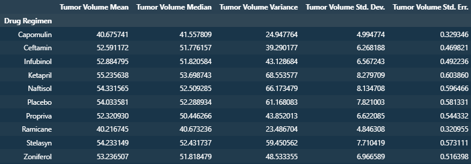
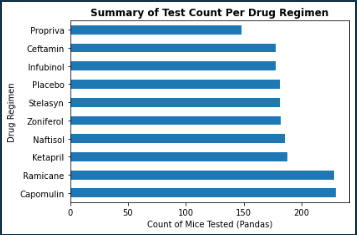
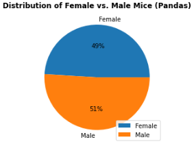
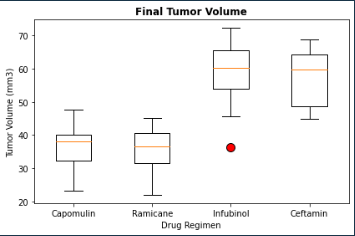
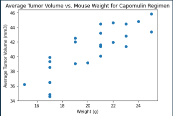
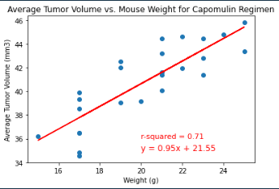

# Mouse Study Data Analysis

This project analyzes data from a study of mice with different drug regimens. The data is stored in two CSV files, "Mouse_metadata.csv" and "Study_results.csv".

## Dependencies and Setup

This project uses the following libraries:

* Numpy
* Matplotlib
* Pandas

## Data Reading and Cleaning

The code reads the two CSV files and merges them into a single dataset. It then checks for duplicate values and removes them.

## Summary Statistics

Summary statistics table of mean, median, variance, standard deviation, and SEM of the tumor volume for each drug regimen.



## Bar and Pie Charts

Bar charts showing the total number of timepoints for all mice tested for each drug regimen using both Pandas and pyplot. It also generates a pie chart showing the distribution of female versus male mice using both Pandas and pyplot.




## Quartiles, Outliers and Boxplots

Calculations of the final tumor volume of each mouse across four of the treatment regimens: Capomulin, Ramicane, Infubinol, and Ceftamin. It then creates a box plot that shows the distribution of the tumor volume for each treatment group.

```
Results for Capomulin:
The lower quartile of tumor volume is: 32.38
The upper quartile of tumor volume is: 40.16
The interquartile range of tumor volume is: 7.78
The median of tumor volume is: 38.13
There are no potential outliers in the data.


Results for Ramicane:
The lower quartile of tumor volume is: 31.56
The upper quartile of tumor volume is: 40.66
The interquartile range of tumor volume is: 9.10
The median of tumor volume is: 36.56
There are no potential outliers in the data.


Results for Infubinol:
The lower quartile of tumor volume is: 54.05
The upper quartile of tumor volume is: 65.53
The interquartile range of tumor volume is: 11.48
The median of tumor volume is: 60.17
Mouse ID c326 has an outlier tumor volume of 36.32


Results for Ceftamin:
The lower quartile of tumor volume is: 48.72
The upper quartile of tumor volume is: 64.30
The interquartile range of tumor volume is: 15.58
The median of tumor volume is: 59.85
There are no potential outliers in the data.
```



## Line and Scatter Plots

Line plot of tumor volume vs. time point for a mouse treated with Capomulin. It also generates a scatter plot of average tumor volume vs. mouse weight for the Capomulin regimen.




## Correlation and Regression

Correlation coefficient and linear regression model for mouse weight and average tumor volume for the Capomulin regimen. It also generates a scatter plot with the regression line and equation and displays the r-squared value.




## Conclusion

Capomulin and Ramicane were found to be the most effective drugs, with Capomulin chosen for further analysis. The tests were conducted on male and female mice, with slightly more males than females participating. A male and female mouse, both aged 22 months, were analyzed and it was observed that the male mouse's tumor size consistently decreased over time, while the female mouse's tumor size fluctuated and did not decrease as much as the male mouse's tumor size. However, since the sample size was limited to one mouse of each sex, further investigation is required. Finally, there was a strong positive correlation was found between the average tumor volume and the weight of mice treated with the Capomulin regimen, with a correlation coefficient of 0.84 and an r-squared value of 0.71.
