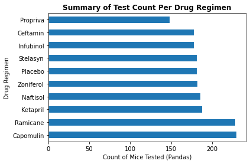
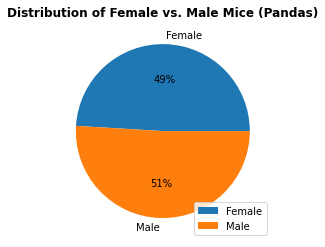
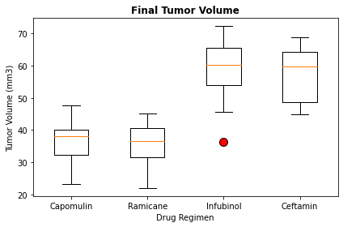
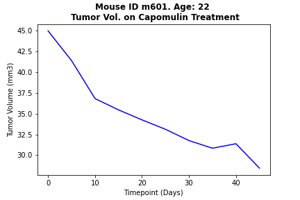
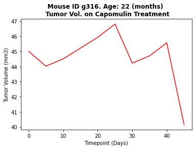
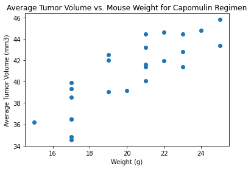

# This project is a bootcamp challenge using matplotlib

###### Summary statistics table of mean, median, variance, standard deviation, and SEM of the tumor volume for each regimen

---

###### Bar plot showing the total number of timepoints for all mice tested for each drug

Capomulin and Ramicane were used mosted on mice for testing and Capomulin will be the drug of interest for deeper analysis. 

---

###### Pie plot showing the distribution of female versus male mice

The testing was tested mostly even between male and female mice with a slight skew towards more male mice going through test.

---

###### Determine tumor size outliers for the following drug types: Capomulin, Ramicane, Infubinol, Ceftamin

**Results for Capomulin**:
The lower quartile of tumor volume is: 32.38 
The upper quartile of tumor volume is: 40.16 
The interquartile range of tumor volume is: 7.78 
The median of tumor volume is: 38.13 
There are no potential outliers in the data. 
 
**Results for Ramicane**:
The lower quartile of tumor volume is: 31.56 
The upper quartile of tumor volume is: 40.66 
The interquartile range of tumor volume is: 9.10 
The median of tumor volume is: 36.56 
There are no potential outliers in the data. 
 
**Results for Infubinol**:
The lower quartile of tumor volume is: 54.05 
The upper quartile of tumor volume is: 65.53 
The interquartile range of tumor volume is: 11.48 
The median of tumor volume is: 60.17 
Mouse ID c326 has an outlier tumor volume of 36.32 
 
**Results for Ceftamin**:
The lower quartile of tumor volume is: 48.72 
The upper quartile of tumor volume is: 64.30 
The interquartile range of tumor volume is: 15.58 
The median of tumor volume is: 59.85 
There are no potential outliers in the data. 
 

Infubinol has one outlier on Mouse c326 with a final tumor size of 36.32 mm3

---

###### Line plot of tumor volume vs. time point for a mouse treated with Capomulin

After analyzing a male and a female mouse, both aged 22 months and treated with Capomulin, we observed that the male mouse's tumor size consistently decreased over time, while the female mouse's tumor size fluctuated and did not decrease as much as the male mouse's tumor size. However, since this is only one sample of each sex, it would be beneficial to investigate further by comparing the average tumor sizes of males and females.

---

###### Scatter plot of average tumor volume vs. mouse weight for the Capomulin regimen

A strong positive correlation exists between the average tumor volume and the weight of mice treated with the Capomulin regimen, with a correlation coefficient of 0.84 and an r-squared value of 0.71.

